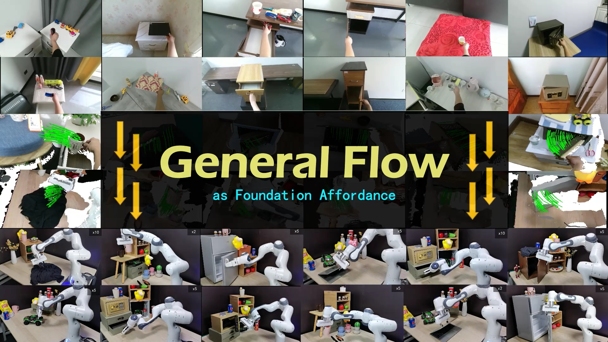
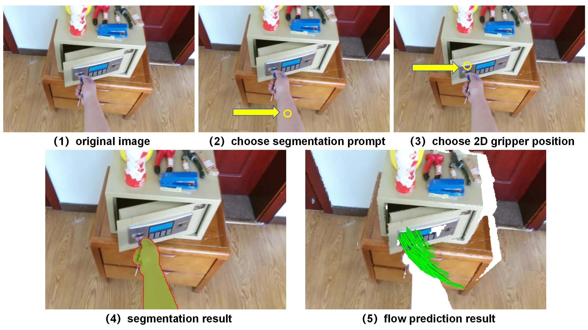

# General Flow as Foundation Affordance for Scalable Robot Learning

**[Chengbo Yuan](https://michaelyuancb.github.io/), [Chuan Wen](https://alvinwen428.github.io/), [Tong Zhang](https://tongzhangthu.github.io/), [Yang Gao](https://yang-gao.weebly.com/).**

**[[Project Website](https://general-flow.github.io/)] [[Arxiv](http://arxiv.org/abs/2401.11439)] [[BibTex](#jump)]**

General Flow is a scalable framework designed to transfer low-level human skills to robots through actionable flow representation. By training exclusively on RGBD human video datasets, this approach successfully achieves an 81% success rate in zero-shot skill transfer across 18 tasks in 6 different scenes.



## Code Release Plan
<input type="checkbox" checked> (Jan 29, 2024) Repository Initalization </input> \
<input type="checkbox" checked> (March 2, 2024) Inference & Evaluation & Pretrained Weight </input> \
<input type="checkbox" checked> (April 4, 2024) Training Code </input> \
<input type="checkbox" checked> (April 4, 2024) HOI4D Data Extraction Pipeline</input> \
<input type="checkbox" > (TODO) "Fold Clothes" Dataset </input> \
<input type="checkbox" > (TODO) Raw-RGBD Data Extraction Pipeline</input> \
<input type="checkbox" > (TODO) Final Version Release </input> 

## Installation

```
conda create -n gflow python=3.9
conda activate gflow
pip install -r requirement.txt
conda install -y pytorch=1.10.1 torchvision cudatoolkit=11.3 -c pytorch -c nvidia
pip install torch-scatter -f https://data.pyg.org/whl/torch-1.10.1+cu113.html
```
Then, follow the `install.sh` script to install the PointNeXt dependencies.

## Model Zoo

First conduct:
```
mkdir log
mkdir log/kpst_hoi4d
```

then download the pretrained model into `log/kpst_hoi4d`:

|  Model   | Eval-ADE  | Eval-FDE | Param(M) | url |
|  ----  |  ----  |  ----  |  ----  |  ----  |
| ScaleFlow-S | 0.0374 | 0.0501 | 0.906 | [link](https://drive.google.com/file/d/1jUW86qDrl8iEkxClE3KjQMpxBwIMRcrZ/view?usp=sharing) |
| ScaleFlow-B | 0.0358 | 0.0477 | 5.622 | [link](https://drive.google.com/file/d/1U8_TpjKg6ycy-URMa5e1ABq_6Xvd9LJ4/view?usp=sharing) |
| ScaleFlow-L | 0.0355 | 0.0470 | 17.088 | [link](https://drive.google.com/file/d/1vJ_mwNfGC8P8WHuLQBdL28e_MywUJeZX/view?usp=sharing) |

**Currently, we only guarantee the execution performance of specific tasks and instructions that are present in our training datasets.** Please refer to `metadata_stat.json` for details. Instructions should be formatted as "something (action) Something (object)". For example, for the "open" action and "safe" object, the instruction should be formatted as "open Safe".

## Quick Start

(1) download [`demo.tar.gz`](https://drive.google.com/file/d/1CUst6UagjiYXkNQ6T08EBQI4T3ffFW_m/view?usp=sharing).

(2) create `tool_repos/` folder, then install [FastSAM](https://github.com/CASIA-IVA-Lab/FastSAM) in `tool_repos/`.

The final structure of the directory tree is:
```
 - demo/
   - input/
     - safe_0_hand/
   - output/
 - tool_repos/
   - FastSAM/
 - aff_exec.py
```

Then, execute the Python script for interactive flow prediction:
```
CUDA_VISIBLE_DEVICES=0 python aff_exec.py --input_dir demo/input/safe_0_hand --desc open_Safe --pretrained_path log/kpst_hoi4d/ScaleGFlow-B/checkpoint/ckpt_best_train_scalegflow_b.pth
```

where ``--desc`` is the instruction (replace spaces with underscores for convenience). This command opens an interactive window that provides an interface to specify the segmentation prompt points and the 2D position of the gripper, as shown in the figure below.



The execution results, along with the visualization file, will be saved in `demo/output/robot_exec.pkl`. Subsequently, run `python vis_exec.py -r demo/output/robot_exec.pkl` for visualization.

Additionally, it's possible to directly specify the gripper position and segmentation prompt. For more information, see `aff_exec.py`.

## HOI4D Data Extraction

The HOI4D pipeline is located in the ``data/HOI4D`` directory. First, navigate to this directory by entering:

```
cd data/HOI4D
```

Next, execute the following command to extract the general flow labels:

```
CUDA_VISIBLE_DEVICES=0 nohup python -u label_gen.py --data_root $HOI4D_ROOT --anno_root $HOI4D_ANNO_ROOT --idx_file $HOI4D_RELASE_FILE --output_root $SAVE_ROOT
```

In this command, `$HOI4D_ROOT` refers to the root directory that stores the RGBD data for the HOI4D dataset, `HOI4D_ANNO_ROOT` is the root directory where the annotations are stored, `HOI4D_RELASE_FILE` is the file path to the `release.txt` of the HOI4D dataset and `$SAVE_ROOT` is the root directory where the extracted general flow dataset will be saved. 

After you have successfully extracted the general flow labels, proceed to generate the final dataset and the training split by running:

```
CUDA_VISIBLE_DEVICES=0 nohup python -u label_gen_merge.py --output_root $SAVE_ROOT
```

You may check out [HOI4D Official Repository](https://github.com/leolyliu/HOI4D-Instructions), `label_gen.py` and `label_gen_merge.py` for more details.

## Model Training

To start modeling training on the extracted dataset:

```
CUDA_VISIBLE_DEVICES=0 nohup python -u train.py --cfg cfg/kpst_hoi4d/EarlyRegPNX-b.yaml val_save=80 --commit AD_base > nul 2>&1 &
```

The pre-process of datasets (for training acceleration) will be performed first (only be performed once). Then the training process will be started automatically.

## Evaluation and Inference on General Flow Dataset

To get prediction and evaluation on the extracted dataset: 

```
CUDA_VISIBLE_DEVICES=0 python inference.py -i $IDX -n $SAMPLE -p $CKPT
```

where `$IDX` represents the index of the data point in the test set, `$SAMPLE` is the number of trajectories to sample, and `$CKPT` is the filepath of the model weight (.pth file). This command will evaluate the test set of the General Flow Datasets (HOI4D + Clothes) and save the visualization file in `results/HOI4D/$model_name/$IDX_n$SAMPLE.pkl`. For visualization, you can run `python vis_inference.py -r results/HOI4D/$model_name/$IDX_n$SAMPLE.pkl`.

## Acknowledgment

This repository is based on the code from [PointNeXt](https://github.com/guochengqian/PointNeXt), [HOI4D](https://github.com/leolyliu/HOI4D-Instructions), [FastSAM](https://github.com/CASIA-IVA-Lab/FastSAM), [100DoH](https://github.com/ddshan/hand_object_detector), [CoTracker](https://github.com/facebookresearch/co-tracker), [PerAct](https://github.com/peract/peract) and [Deoxys](https://github.com/UT-Austin-RPL/deoxys_control).

## Citation

If you find this repository useful, please kindly acknowledge our work <span id="jump">:</span>
```tex
@article{yuan2024general,
  title={General Flow as Foundation Affordance for Scalable Robot Learning},
  author={Yuan, Chengbo and Wen, Chuan and Zhang, Tong and Gao, Yang},
  journal={arXiv preprint arXiv:2401.11439},
  year={2024}
}
```


